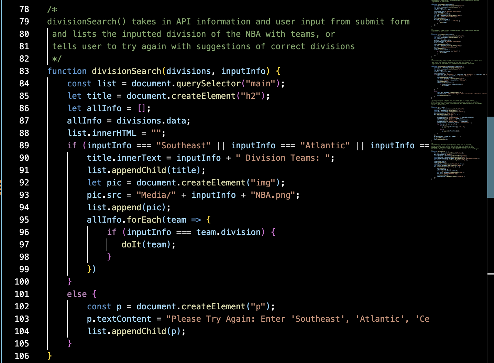
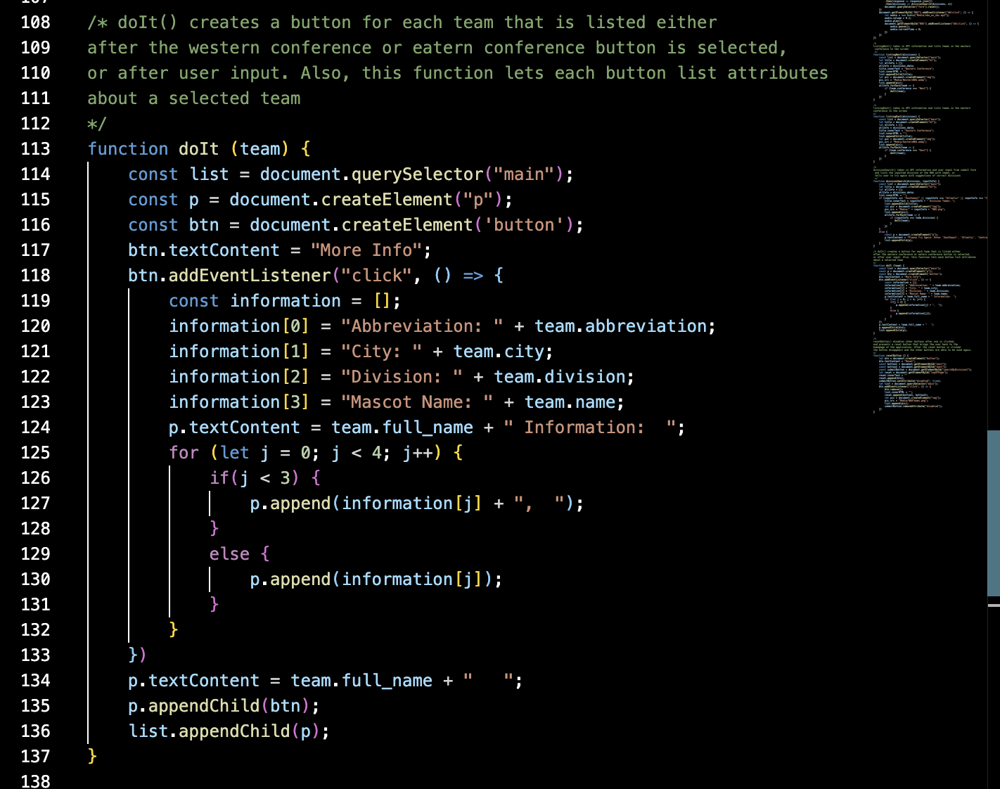

# NBA Team Database #
============================================================================

# Introduction
----------------------------------------------------------------------------
 Welcome to the NBA Teams Database! This README.md file will first walk through all of the wonderful features, descriptive images, and exciting CSS choices! Afterwords, this file will introduce a video that displays all of the uses of this application, followed by a few brief snippets of code that make the whole thing work! I hope this information is useful and allows the user to enjoy the NBA Teams Database!
 
 This application uses JavaScript, CSS, and HTML to create an exciting way to allow users to search for their favorite NBA (National Basketball Association) team in a few different ways. Using this application allows the user to access a number of features, such as:
                
                * Search NBA teams by division using a submit form
                * Select a conference for NBA teams (East or West) using buttons
                * Learn basic facts about each team using the "more info" buttons
                * A reset button to bring the page back to the home screen after a previous selection
                * A secret surprise sound if the NBA logo is double-clicked

----------------------------------------------------------------------------

 Along with the features, this application also displays an image relating to each of the possible entries. One possible form of user entry is through the "Western Conference" or "Eastern Conference" buttons, while the other form would be through the "Search By Division" submission feature. These two possibilities return team names containing basic information about the teams, accessible through buttons labelede "more info", and these type of images relating to the entry pictured below:

----------------------------------------------------------------------------

----------------------------------------------------------------------------

Lastly, this application displays a fun color scheme along with a border image of a basketball to tie itself back to the core idea of the website, the NBA. This will be apparent in the usage section below! The CSS behind the border image was something new to me, but I found it quite simple to include in this application. Here is a snippet showing the line that created this fun border:

============================================================================
# Usage 
----------------------------------------------------------------------------
Link to video: 
                *

This video displays a user walking through each of the different features that this application offers, along with a visual representation of what exactly the formatting and layout of the application looks like. Each feature is explained and an example of how to use the application to access each feature is given in this video as well. Please visit this link to explore the video and gain understanding on the uses of this application!

----------------------------------------------------------------------------
# Code Examples

The following code snippet is a function that takes information from the API server and the user input from the submission form to create a list of teams within the given Division:

The following code snippet is a function that creates a button for each team listed that allows the user to view more information about the selected team:

These are just two examples of the code that makes this application work, hopefully these give some kind of insight on the inner workings of this application.

===========================================================================
# Citations

This application uses the https://www.balldontlie.io/api/v1/teams/ API to sort and display the correct information for each team based on the selection made by the user. There are also images and an audio file used in this application from the following sources:

                * Atlantic NBA Image: "https://fantasysixpack.net/2021-22-fantasy-basketball-division-preview-atlantic/"

                * Basketball Image: "https://www.dreamstime.com/stock-photos-basketball-close-up-image16638533"

                * Central NBA Image: "https://wausaupilotandreview.com/2023/10/17/bucks-look-to-set-the-pace-again-in-nbas-central-division-behind-giannis-lillard/"

                * Eastern NBA Image: "https://www.foxsports.com/stories/nba/nba-eastern-conference-guide-nets-bucks-celtics-76ers-remain-contenders"

                * NBA on NBC Audio: "https://www.youtube.com/watch?v=yMyYwoTMIgY"

                * NBA teams image: "https://www.zenbusiness.com/blog/top-nba-teams-logos/"

                * Northwest NBA Image: "https://fantasysixpack.net/2021-22-fantasy-basketball-division-preview-northwest/"

                * Pacific NBA Image: "https://www.scoresandstats.com/gambling-news/2022-nba-pacific-division-futures-odds-and-picks/"

                * Southeast NBA Image: "https://fantasysixpack.net/2023-24-fantasy-basketball-southeast-division-preview/"

                * Southwest NBA Image: "https://fantasysixpack.net/2021-22-fantasy-basketball-division-preview-southwest/"

                * Western NBA Image: "https://www.foxsports.com/stories/nba/nba-western-conference-guide-warriors-have-tough-road-to-repeat"

